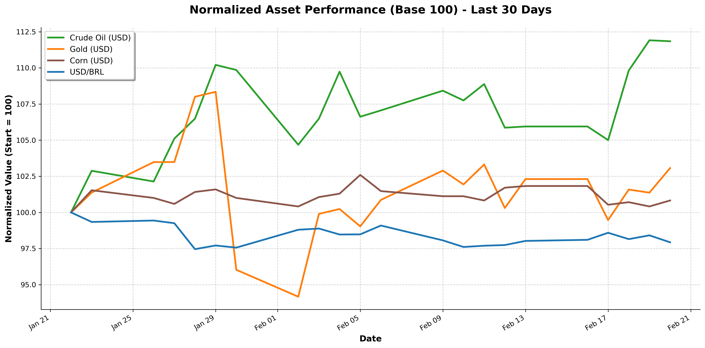

# 📈 Financial Market Data Pipeline & Quantitative Analysis
### 🔴 **Live Web App:** [Click here to access the Interactive Dashboard](https://fernando-market-data.streamlit.app)

## 🎯 Project Overview
In the financial and commodities markets, having access to clean, reliable, and real-time data is critical for strategic decision-making. Manual data extraction is prone to human error and highly inefficient. 

This project is an automated **ETL (Extract, Transform, Load) Pipeline** built in Python. It extracts real-time market data for key global assets via the Yahoo Finance API, cleans missing time-series data due to market holidays, calculates quantitative financial metrics, and generates a normalized visualization for comparative performance.

### 📊 Monitored Assets
- **Crude Oil (WTI)** - Global energy benchmark
- **Gold** - Traditional safe-haven asset
- **Corn** - Key agricultural commodity
- **USD/BRL** - Currency exchange rate for emerging markets context

---

## 🚀 Key Features & Pipeline Architecture

### Phase 1: Data Ingestion (API Extraction)
- Replaced fragile web scraping techniques with robust API calls using `yfinance`.
- Fetches 30 days of historical daily closing prices.
- Highly resilient: zero CAPTCHA blocks, no HTML parsing errors, and structured data output.

### Phase 2: Time-Series Transformation & Cleaning
- **Missing Data Imputation:** Utilized the Forward Fill (`ffill`) method to handle `NaN` values caused by weekend and holiday market closures, ensuring a continuous time-series.
- **Financial Metrics:** Calculated Daily Returns (%) and Annualized Volatility to assess asset risk.
- Calculated the Total Return for the period.

### Phase 3: Visualization & Export
- **Base 100 Normalization:** Standardized all asset prices to a starting value of 100. This allows for an accurate visual comparison of percentage growth regardless of the underlying asset's nominal price (e.g., comparing $5,000 Gold to $60 Oil).
- **Automated Export:** Generates clean `.csv` datasets and high-resolution `.png` charts ready for business intelligence dashboards or management reports.
- 

---

## 🛠️ Tech Stack
- **Language:** Python 3.x
- **Data Extraction:** `yfinance` (Official Yahoo Finance API wrapper)
- **Data Manipulation:** `pandas`, `numpy`
- **Data Visualization:** `matplotlib`

---

## ⚙️ How to Run the Project

1. Clone this repository to your local machine.
2. Install the required dependencies using:
   ```bash
   pip install -r requirements.txt
